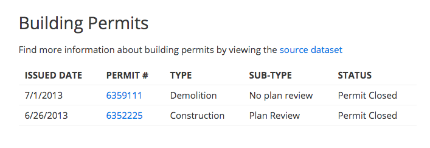

Prototype Chrome extension for embedding open data in to Zillow detail pages.

Only works in Seattle and only for home detail pages right now.

Example homes:

- [10007 31st Ave SW, Seattle, WA 98146](http://www.zillow.com/homedetails/10007-31st-Ave-SW-Seattle-WA-98146/49038210_zpid/)
- [10024 21st Ave NE, Seattle, WA 98125](http://www.zillow.com/homedetails/10024-21st-Ave-NE-Seattle-WA-98125/48946982_zpid/)

# Installing

1. Download the `.crx` bundled extension from the [latest release](https://github.com/chrismetcalf/fixer-upper/releases)
2. Open up <chrome://extensions> (you may need to type that in by hand)
3. Drag and drop the `.crx` file into your Chrome window and accept the install warning
